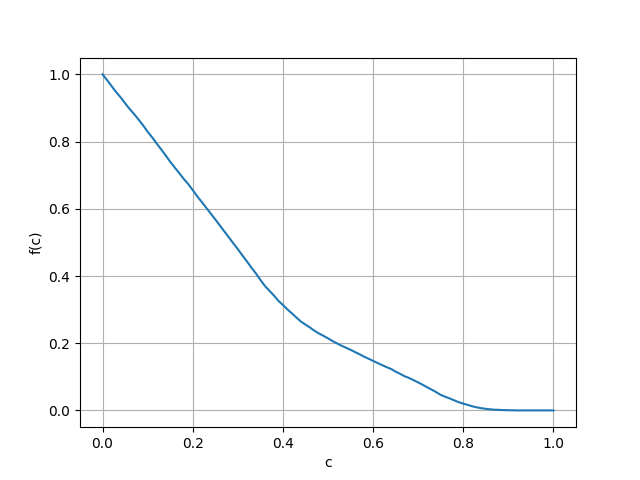

# Report clustering and classification
_Rebecca Küpper_  
_1008070_  
_8CC00_  

## Model and implementation
This code consists of 7 python files:

* **main.py**: the main code file with which the assignments were done.
* **dataETL.py**: file containing functions for extraction, tranformation and loading of the data. These functions were specifically designed based on the format of the data that was provided for this project.
* **dataProcessing.py**: file containing some basic data processing functions that are non-data-format specific.
* **clustering.py**: file containing functions for k-means clustering and HCS clustering.
* **Graph.py**: file containing the Graph class that was used for the HCS clustering.
* **classification.py**: file containing functions for k nearest neighbour classification and classification in general.
* **test.py** testfile for in-between testing. Does not contribute to the project whatsoever.

### Data import 
The data import was broken down into three functions (in `dataETL.py`). The first function, `extractData()` creates the variables `data`, in which the bare data was stored `celllinenames` in which the names of the cell lines were stored and `genes`, in which the names of the genes were stored.  
The second function, `selectData()` only selects the data from the 145 cell lines that were assigned to me by email.  
The third function, `extractLabels()` creates a dictionary for the cell line names and their labels.

### Clustering 
#### k-means clustering and silhouette scores
k-means clustering was broken down into multiple smaller functions that call each other. The first is the calculation of the squared Euclidean distance (`squaredEuclideanDist()`). 
Another smaller function is `calculateCentroids()`, which calculates the location of the new centroids. Both of these functions were used in the function `kMeans()` which calculates k clusters.  
To validate the performance of a certain k, the silhouette score can be calculated with the function `silhouetteScore()` which first calculates the silhouette for each datapoint and then calculates the overall silhouette score for a clustering. 

#### HCS clustering 
For the highly connected subgraph clustering, correlation coefficients needed to be calculated for every possible node pair. This was broken down into several smaller functions in the dataProcessing.py file. Here, the functions for the calculaion of the covariance, the standard deviation and the Pearson correlation coefficient of two parameters can be found. These functions were then used to calculate all correlation coefficients with the function `overallCorrelationcoefficients()` in the file clustering.py. `overallCorrelationcoefficients()` returns a dictionary containing all possible nodepairs and their respective correlation, which is in main.py stored in the variable `corrCoef`.  
Then, a threshold was needed to decide which nodes share an edge and which do not. In the assignment a node pair fraction was given, so this had to be calculated. The function `nodepairFraction()` in clustering.py calculates this fraction.  

Then, for a threshold _c_, a list of edges can be created, which is done by the function `createEdges()` in clustering.py.  
In order to create graphs, a separate python file (Graph.py) was created, containing the class `Graph`, which initialises a graph from a list of edges as, for example, created by `createEdges()`. Graph objects have an attribute `graph`, which is a dictionary in which per node is stored to which other nodes it is connected. 
So, now we have a graph on which we can perform HCS clustering with the function `HCS()`. This was also broken down into smaller pieces, like `kargerMinCut()`, wich was broken down to edgecontraction by `contractEdge()` and `highlyConnected()`, to check if a (sub)graph is highly connected and `karger2subgraph()` wich turns the output of `kargerMinCut()` into a graph format. 

### Classification 
#### k Nearest neighbour classification 

k nearest neighbour classification was done with the function `nearestNeighbour()` in classification.py. A function that was written to break the problem down a bit is `findName()`, which returns the name of the input datapoint. The function also uses the `squaredEuclideanDist()` from clustering.py and was further easy enough that it was not needed to break down further. 

For the leave-one-out validation, a trainingsset was needed, which can be generated with `generateTrainingset()` from classification.py. Also for validation the functon `checkLabel()` was created to check an assigned label and return wether it is correct. 

#### HCS classification 
Label determinaton for HCS classification seemed very specific and was therefore done in main.py.


## Complexity analysis
The k-means clustering and its validation is very slow, because it has to loop over all datapoints for multiple times to get the highest possible silhouette score for k and then over multiple k. So, the time it takes for this part to run grows exponentially with the number of datapoints.

The HCS clustering goes a littel faster, since there is no loop over all datapoints. Only within subgraphs, which makes it faster than k-means. Still, it takes some time to calculate, since the calculation of the minimum Karger cut is an iterative process. 

k nearest neighbours is also very slow, because it has to loop over all datapoints to generate a different trainingsset per datapoint and then again in the method itself to calculate the distances with all the other datapoints. The time it takes should grow quadratically with addition of datapoints. 

The HCS classification is performed with the clusters that were formed in the clustering part, so it only loops over the nodes in each cluster, which is a lot faster then k nearest neighbours. 


## Version control 
Version control was done in github. Additions, changes and more can be found on github.

The design process went very straightfoward, except for the HCS clustering. At fist, all methods for HCS were supposed to be in the Graph class, but it kept going wrong. The HCS methods were then put in the clustering.py file, but still strange phenomena occured. Eventually the cause for the problem was found to be the builtin `dict.copy()` function, which does not copy your dictionary neatly, causing your original dictionary to sometimes also change with the copy, but not always somehow. The problem was solved with `deepcopy()` from the `copy` library. 
The HCS methods were never reverted back to the `Graph` class however. 

## Interpretation of the results 
The results of running main.py are:

```
k | silhouette score
2 | 0.45134002806441736
3 | 0.44538395104207623
4 | 0.44643352006852566
5 | 0.4378348721634607
6 | 0.44347135560486667
7 | 0.39600233306162885
8 | 0.365546194496178
HCS cluster: ['HT-29', 'LS-411N', 'SW1417', 'COLO-205', 'RCM-1', 'LS-513', 'LS-180', 'LS-1034', 'T84', 'SW948', 'HCC2998', 'HCC-56', 'HT-115', 'SW1116', 'SW1463', 'SNU-61', 'SNU-81', 'SNU-C1', 'GP5d', 'HT55', 'CCK-81', 'NCI-H630', 'SNU-1040', 'LoVo', 'SNU-407', 'CW-2', 'CL-11']
HCS cluster: ['HCC1419', 'BT-474', 'EFM-192A', 'MFM-223', 'UACC-893', 'CAMA-1', 'EFM-19', 'MDA-MB-361', 'MDA-MB-453', 'EVSA-T', 'HCC202', 'HCC2218', 'MDA-MB-415', 'MDA-MB-330', 'BT-483']
HCS cluster: ['CAL-85-1', 'HDQ-P1', 'CaR-1', 'HCC1937', 'HCC70', 'MDA-MB-468']
Error score k-nearest neighbours per k: Counter({'k = 22': 11, 'k = 23': 11, 'k = 24': 11, 'k = 25': 11, 'k = 18': 10, 'k = 1': 10, 'k = 2': 10, 'k = 5': 10, 'k = 6': 10, 'k = 10': 10, 'k = 11': 10, 'k = 12': 10, 'k = 13': 10, 'k = 14': 10, 'k = 20': 10, 'k = 21': 10, 'k = 17': 9, 'k = 3': 9, 'k = 19': 9, 'k = 4': 9, 'k = 7': 8, 'k = 8': 8, 'k = 9': 8, 'k = 15': 8, 'k = 16': 8})
Error score for HCS classification: 1
```

### Clustering 
#### k-means
For k-means, it can be observed that _k = 2_ until _k = 6_ are very similar. It was observed that for _k > 2_ empty clusters started occuring, increasing in numbers when increasing _k_.  
When looking at these silhouette scores, the highest score is for _k = 2_ and the second highest score is for _k = 4_. That _k = 4_ has sucha high score can be explained with the fact that these cell lines originate from 4 different cancer types. That _k = 2_ scores even higher seems odd, but it could be possible that one of the cancertypes differs very much from the other three, therefore making 2 clusters more favorable.  

#### HCS
A plot was made for node pair fraction versus threshold:


It can be observed that for _c = 0.66_, _f(c) ≈ 0.1_, so _c = 0.66_ was chosen to be the threshold for edges in HCS. 

For the results of the HCS clustering, it immediately stands out that there are only 3 clusters present. Also, the total number of nodes in these clusters is only one third of the original number of nodes. This could be explained by the fact that singlets were discarded in the `HCS()` method.  

When taking a closer look at the nodes in the three clusters, one quickly finds out that two of the clusters contain mostly _BRCA_ labelled cell lines and the other contains mostly _COAD/READ_ labelled cell lines. I find it strange that apparently all _NB_ and _KIRC_ cell lines were cut out as singlets.  


### Classification 
It kan be observed that for _k = 7, k = 8, k = 9, k = 15_ and _k = 16_ the number of wrongly assigned datapoints is 8. Preferentially, the lowest of these is chosen, to save computation time. 

For the HCS classification, only 1 point was in a cluster with the wrong label. However, only approximately a third of the nodes ended up in a cluster, which makes this method difficult to use in practice. 


.
